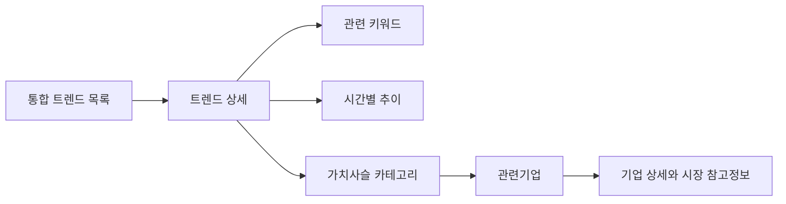

# Claude Design 프론트 연결 인수인계

## 연결 주소

```text
Production API: https://trzip-x-google.vercel.app
Demo endpoint:  /api/v1/intelligence?at=2026-08-12T11:00:00%2B09:00&hours=168
Live endpoint:  /api/v1/korea/curated-feed
```

## 필수 화면 흐름



## 목록 필드 매핑

| 화면 | 필드 | 주의사항 |
|---|---|---|
| 순위 | `rank` | 기본 통합순위 |
| 트렌드명 | `display_name` | `phenomenon_summary`로 대체 금지 |
| 원천 표현 | `raw_terms` | 태그 또는 보조문구 |
| 왜 뜨는가 | `phenomenon_summary` | 원인 미확인 상태도 그대로 노출 |
| 분류 | `classification` | 일반 트렌드, 맥락 확인, 이슈·주의 |
| 상태 | `lifecycle` | 신규·급상승·지속·대중화·재부상·둔화 |
| 카테고리 | `category` | UI에서 한국어 라벨 매핑 |
| 점수 | `score` | 투자 점수가 아니라 트렌드 점수 |
| X/Google | `latest_source_ranks` | 없는 소스는 `—` 표시 |
| 지속기간 | `age_hours` | `persistence`는 관찰창 대비 비율 |

## 절대 합치면 안 되는 필드

```text
display_name        = 말복
raw_terms           = [말복, 삼계탕, 보양식]
phenomenon_summary  = 말복을 앞두고 삼계탕·보양식·외식 관심이 증가
```

카드 제목은 `말복`입니다. `말복 삼계탕·보양식 소비`라는 새 제목을 만들지 마십시오.

## 목록 정렬

- 통합순위: `rank`
- 지속기간순: `persistence_rank`
- 급상승순: `momentum_rank`

필터로 목록을 분리하더라도 백엔드의 통합순위 원본을 삭제하거나 재계산하지 마십시오.

## 상태별 표현

| 상태 | UI 권장 방식 |
|---|---|
| 일반 트렌드 | 기본 카드 |
| 맥락 확인 | 중립 배지와 `원인 미확인` 표시 |
| 이슈·주의 | 경고 배지, 기업 영역 비활성화 |
| 재구성 데모 | `실측 아님` 고정 표시 |
| 초기 관찰 | 데이터 부족 안내 |

## 기업 영역

`companies`와 `company_categories`를 사용합니다.

- `official_evidence`: 공식 관계
- `pending_evidence`: 검증 대기
- `industry_structure_only`: 산업 후보
- `excluded`: 제외

`industry_structure_only`를 수혜주나 추천주로 표시하면 안 됩니다. `investment_warning`을 상세 화면에 노출하십시오.

## 프론트 호출 예시

```javascript
const API = "https://trzip-x-google.vercel.app";

export async function getDemoTrends() {
  const params = new URLSearchParams({
    at: "2026-08-12T11:00:00+09:00",
    hours: "168",
  });
  const response = await fetch(`${API}/api/v1/intelligence?${params}`);
  if (!response.ok) throw new Error(`TRZIP API ${response.status}`);
  return response.json();
}
```

## 권장 컴포넌트

```text
TrendRankingPage
 ├─ DatasetModeSwitch
 ├─ RankingSortTabs
 ├─ TrendTable 또는 TrendCardList
 │   └─ TrendStatusBadge
 └─ TrendDetail
     ├─ SourceTerms
     ├─ PhenomenonSummary
     ├─ RelatedKeywords
     ├─ HourlyTrendChart
     ├─ ValueChainGroups
     └─ CompanyDetailSheet
```

## 로딩·오류 처리

1. 응답 전에는 기존 목록을 지우지 말고 스켈레톤을 표시합니다.
2. API 실패 시 데모와 실측을 혼합하지 않습니다.
3. X 수집이 `unavailable`이어도 Google 데이터만으로 반환된 목록을 표시합니다.
4. 빈 기업 목록은 오류가 아니라 `기업 연결 보류` 상태입니다.
5. 모바일에서는 표 전체를 억지로 축소하지 말고 카드 목록으로 전환합니다.

## 완료 조건

- `말복` 카드 제목과 현상 설명이 분리됨
- 통합순위·지속기간순·급상승순 전환 가능
- 원천 표현과 데이터 신뢰도 확인 가능
- 이슈·주의 항목에서 기업 추천처럼 보이지 않음
- 기업 관계 근거 상태와 투자 유의사항 노출
- 데모와 실측이 명확히 구분됨
