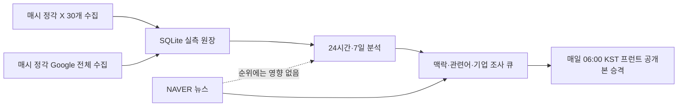

# TRZIP 제품·데이터 흐름

## 한 줄 정의

TRZIP은 X 대한민국 실시간 트렌드와 Google Trending Now 대한민국 관측값을 한 시간마다 축적하고, 최근 24시간의 확산 흐름을 하루 한 번 정리해 트렌드의 맥락·관련 검색어·상장기업 관계망을 함께 제공하는 서비스입니다.

## 운영 주기



- 순위 입력: X와 Google만 사용합니다.
- 보조 조사: NAVER 뉴스와 공식 발표를 맥락·기업 근거에 사용하되 순위 점수·정렬·적격성은 바꾸지 않습니다. YouTube·Instagram·NAVER 블로그·검색트렌드는 현재 활성 경로에서 제외합니다.
- 내부 갱신: 수집·원장·24시간/7일 분석·보강 큐는 매시간 갱신합니다.
- 프런트 공개: 짧은 노이즈가 화면을 흔들지 않도록 매일 06:00 KST에 한 번만 원격 공개본을 승격합니다.
- 실패 격리: 같은 시간의 X와 Google이 모두 정상 관측되지 않으면 원격 정상 공개본을 덮어쓰지 않습니다.

## 핵심 기능

1. **오늘의 흐름 보드**: 최근 24시간의 관심 강도, 상승 속도, 교차 확산, 지속성, 최신성을 계산해 `확산 중·계속 화제·막 포착됨`으로 묶습니다. 카드에는 숫자 순위를 표시하지 않습니다.
2. **상승 트렌드**: 비교 가능한 이전 구간보다 실제로 상승한 현재 트렌드만 별도로 제공합니다.
3. **트렌드 정의와 지금 뜨는 이유**: 관측 표현을 구체적인 제품·작품·행사·브랜드·밈·기술·시장 대상으로 해석하고 출처와 함께 설명합니다.
4. **관련 검색어 5개**: 실측 관련 검색어, 동시 등장 표현, 검수된 사건 표현만 사용합니다.
5. **기업 관계망**: 국내외 상장기업 10개 이상을 2~4개 역할 카테고리로 묶습니다. 각 기업에는 종목코드, 거래소, 설명, 연결 이유, URL 근거, 최소 2단계 온톨로지 경로가 필요합니다.
6. **트렌드 상태**: `new`, `rising`, `sustained`, `rebounding`, `cooling`, `expired`, `insufficient_data`를 제공합니다.
7. **관심도 변화**: 24시간과 7일의 동일 길이 이전 구간 점수 대비 증감률을 제공합니다. 이는 플랫폼별 절대 언급량이 아니라 X·Google 관측 순위를 합성한 관심도 지수 변화입니다.

## 화면별 정보 구조

### Z1 홈

```text
[관측 기준일 / 데이터 상태]
[오늘의 흐름]
  확산 중 · 계속 화제 · 막 포착됨
  대표 키워드 · 카테고리 · 관측 플랫폼 · 확산 상태
[기존 프런트 호환 Top10 — deprecated]
[밈트폴리오 / 저장 진입]
```

### Z2 트렌드 상세

```text
[트렌드명] [8개 대분류] [확산 상태]
트렌드 정의 / 지금 뜨는 이유 / 관측 출처
24시간 관심도 변화 / 7일 관심도 변화
관련 검색어 정확히 5개
기업 역할 탭 2~4개
  기업명 · 종목코드 · 거래소
  기업 설명 · 연결 이유 · 관계 등급 · 근거
```

### Z3·Z6 밈트폴리오

- 트렌드와 관련 기업을 선택해 개인 폴더를 만듭니다.
- 공개 순위와 기업 근거는 백엔드 공개본을 읽고, 사용자 저장은 별도 로컬 상태로 관리합니다.

### Z4·Z5 커뮤니티

- 사용자가 만든 트렌드·기업 묶음을 둘러보는 공간입니다.
- 현재 수익률·좋아요 등 일부는 목업이므로 실제 사용자 데이터와 혼동하지 않아야 합니다.

### Z7 마이

- 사용자가 저장한 폴더와 내보내기 결과를 보여줍니다.

## 프런트 공개 데이터 계약

```json
{
  "publication_id": "immutable-id",
  "observed_at": "UTC timestamp",
  "home_feed": {
    "status": "ready",
    "groups": [
      {
        "key": "spreading",
        "label": "확산 중",
        "trends": [
          {
            "event_key": "stable-event-key",
            "display_name": "트렌드 키워드",
            "source_presence": ["x", "google_trends"],
            "broad_category": "content",
            "category_label": "콘텐츠",
            "lifecycle": "rising"
          }
        ]
      }
    ]
  },
  "home_top10": [
    {
      "event_key": "stable-event-key",
      "display_name": "트렌드 키워드",
      "publication_rank": 1,
      "broad_category": "content",
      "category_label": "콘텐츠",
      "lifecycle": "rising",
      "attention_change": {
        "24h": {"status": "measured", "percent": 18.2, "basis": "previous_equal_period_score"},
        "7d": {"status": "unavailable", "percent": null, "basis": "previous_equal_period_score"}
      },
      "trend_definition": "X와 Google 대한민국 관측에 근거한 설명",
      "related_keywords": ["키워드1", "키워드2", "키워드3", "키워드4", "키워드5"],
      "keyword_status": "ready",
      "company_status": "ready",
      "companies": ["근거가 완비된 국내외 상장기업 10개 이상"]
    }
  ],
  "rising_top10": [],
  "all_observed_ranking": [],
  "trend_detail_index": {}
}
```

## 과거 한 달 복원 데이터

- 대상: 최근 한 달에서 **해당 출처·해당 시간 전체가 비어 있는 슬롯만** 복원합니다.
- 실측 우선: 같은 출처와 시간에 실측 행이 하나라도 있으면 복원 행을 추가하지 않습니다.
- 원장 분리: 복원 데이터는 라이브 SQLite 순위 원장에 들어가지 않습니다.
- 표시: 모든 복원 행은 `mode=demo_replay`, `live_eligible=false`, `ranking_effect=demo_replay_only`로 구분합니다.
- 용도: 발표 시 장기 흐름과 기능 시연을 위한 별도 데모이며, 실제 24시간 Top10의 근거로 제시하지 않습니다.

## 완료 판단

- X 30개와 Google 전체가 같은 시각에 정상 관측됨
- 원본 통합 점수와 순위를 보강 데이터가 변경하지 않음
- `home_feed`는 순위·점수 없이 완성 카드만 제공하고, 호환 Top10은 최대 10개만 별도로 제공
- 홈 항목마다 관련어 5개, 검증 상장기업 10개 이상, 역할 카테고리 2~4개
- 기업마다 종목코드·거래소·설명·연결 이유·URL·2단계 이상 관계 경로 완비
- 원격 공개는 일 1회이며 불완전 수집이 정상 공개본을 덮어쓰지 않음
- 불변 publication의 manifest, SHA-256, publication_id 검증 통과
