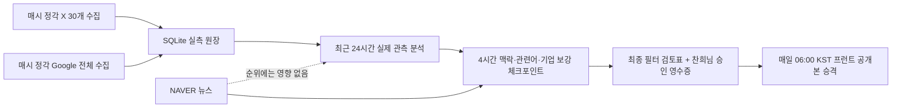

# TRZIP 제품·데이터 흐름

## 한 줄 정의

TRZIP은 X 대한민국 실시간 트렌드와 Google Trending Now 대한민국 관측값을 한 시간마다 축적하고, 최근 24시간의 확산 흐름을 하루 한 번 정리해 트렌드의 맥락·관련 검색어·상장기업 관계망을 함께 제공하는 서비스입니다.

## 운영 주기



- 순위 입력: X와 Google만 사용합니다.
- 보조 조사: NAVER 뉴스와 공식 발표를 맥락·기업 근거에 사용하되 순위 점수·정렬·적격성은 바꾸지 않습니다. YouTube·Instagram·NAVER 블로그·검색트렌드는 현재 활성 경로에서 제외합니다.
- 내부 갱신: 수집·원장·24시간 분석은 매시간 갱신하고, 느린 맥락·키워드·기업 보강은 4시간 체크포인트로 묶습니다.
- 프런트 공개: 짧은 노이즈가 화면을 흔들지 않도록 매일 06:00 KST에 한 번만 원격 공개본을 승격합니다.
- 최종 승인: 자동 필터 결과와 탈락 사유가 들어 있는 같은 시각의 검토표를 먼저 확인하고, 제품 소유자가 승인한 트렌드만 공개합니다. 승인 없음·검토표 해시 불일치·미완성 후보 승인은 모두 원격 쓰기 전에 실패 폐쇄됩니다.
- 실패 격리: 최근 24시간 안에 X 또는 Google의 유효 실측이 한 번도 없으면 원격 정상 공개본을 덮어쓰지 않습니다. 개별 정각의 누락은 감사 정보로 남기고 이전값을 재사용하거나 합성하지 않습니다.

## 핵심 기능

1. **실시간 트렌드 0~10개**: 최근 24시간의 관심 강도, 상승 속도, 교차 확산, 지속성, 최신성을 계산하고 전체 완성 계약을 통과한 항목만 현재 공개 순서로 보여줍니다. 완성 항목이 부족하면 있는 수만 표시합니다.
2. **상승 트렌드**: 비교 가능한 이전 구간보다 실제로 상승한 현재 트렌드만 별도로 제공합니다.
3. **트렌드 정의와 지금 뜨는 이유**: 관측 표현을 구체적인 제품·작품·행사·브랜드·밈·기술·시장 대상으로 해석하고 출처와 함께 설명합니다.
4. **관련 검색어 5개**: 실측 관련 검색어, 동시 등장 표현, 검수된 사건 표현만 사용합니다.
5. **기업 관계망**: 국내외 상장기업 10개 이상을 3~4개 역할 카테고리로 묶습니다. 각 기업에는 종목코드, 거래소, 설명, 연결 이유, URL 근거, 최소 2단계 온톨로지 경로가 필요합니다.
6. **트렌드 상태**: `new`, `rising`, `sustained`, `rebounding`, `cooling`, `expired`, `insufficient_data`를 제공합니다.
7. **순위 반응형 관심 흐름**: 각 실제 X·Google 관측점에 원천 순위 45%, 원천·이전 공개 순위 변화 20%, 관측 지속성 15%, 현재 공개 순위 20%를 적용해 0~100 표시지수를 만듭니다. 공개 순위는 표시지수와 선 굵기·점 크기·모션 속도에 반영되지만, 원천 순위·Python 점수·기업 시장데이터는 바꾸지 않습니다. 결측 구간은 선을 끊고 보간·이전값 재사용·가짜 관측점 추가를 하지 않습니다.

## 화면별 정보 구조

### Z1 홈

```text
[관측 기준일 / 데이터 상태]
[실시간 트렌드 0~10개]
  현재 공개 순서 · 대표 키워드 · 카테고리 · X/Google 관측 출처 · 순위 이동
[밈트폴리오 / 저장 진입]
```

### Z2 트렌드 상세

```text
[트렌드명] [8개 대분류] [확산 상태]
트렌드 정의 / 지금 뜨는 이유 / 관측 출처
실제 관측 순위 기반 관심지수 1주 / 1개월 / 3개월
관련 검색어 정확히 5개
기업 역할 탭 3~4개
  기업명 · 종목코드 · 거래소
  기업 설명 · 연결 이유
```

### Z3·Z6 밈트폴리오

- 사용자 이모지·이름·해시태그·기업을 선택해 개인 포트를 만듭니다.
- 종목 추가는 검색 모달에서 한글명·영문명·티커로 찾고, 사용자 저장은 별도 로컬 상태로 관리합니다.

### Z4·Z5 커뮤니티

- 사용자가 만든 트렌드·기업 묶음을 둘러보는 공간입니다.
- 승인된 인기 포트 4건은 `seed_portfolio`로 라이브 트렌드·기업·순위와 격리합니다.

### Z7 마이

- 사용자가 저장한 포트를 사용자 이모지와 함께 보여줍니다.

## 프런트 공개 데이터 계약

```json
{
  "publication_id": "immutable-id",
  "observed_at": "UTC timestamp",
  "home_feed": {
    "status": "ready",
    "groups": [
      {
        "key": "spreading",
        "label": "확산 중",
        "trends": [
          {
            "event_key": "stable-event-key",
            "display_name": "트렌드 키워드",
            "source_presence": ["x", "google_trends"],
            "broad_category": "content",
            "category_label": "콘텐츠",
            "lifecycle": "rising"
          }
        ]
      }
    ]
  },
  "presentation_feed": {
    "schema_version": "trzip-presentation-feed-v4",
    "status": "ready",
    "selection_policy": "validated_live_home_feed_v1",
    "items": [
    {
      "event_key": "stable-event-key",
      "display_name": "트렌드 키워드",
      "presentation_position": 1,
      "broad_category": "content",
      "category_label": "콘텐츠",
      "lifecycle": "rising",
      "visualization_series": {"1w": {"points": [], "interpolation": "none"}},
      "trend_definition": "X와 Google 대한민국 관측에 근거한 설명",
      "related_keywords": ["키워드1", "키워드2", "키워드3", "키워드4", "키워드5"],
      "keyword_status": "ready",
      "company_status": "ready",
      "companies": ["근거가 완비된 국내외 상장기업 정확히 10개"]
    }
    ],
    "transition": {"synthetic_data_used": false, "padding_forbidden": true}
  },
  "rising_top10": [],
  "all_observed_ranking": [],
  "trend_detail_index": {}
}
```

## 과거 한 달 복원 데이터

- 대상: 최근 한 달에서 **해당 출처·해당 시간 전체가 비어 있는 슬롯만** 복원합니다.
- 실측 우선: 같은 출처와 시간에 실측 행이 하나라도 있으면 복원 행을 추가하지 않습니다.
- 원장 분리: 복원 데이터는 라이브 SQLite 순위 원장에 들어가지 않습니다.
- 표시: 모든 복원 행은 `mode=demo_replay`, `live_eligible=false`, `ranking_effect=demo_replay_only`로 구분합니다.
- 용도: 회귀 테스트와 과거 사례 연구용 별도 자료이며, 실제 24시간 라이브 피드의 근거로 제시하거나 자동 대체하지 않습니다.

## 완료 판단

- 최근 24시간 안에 X 30개 정상 관측과 Google 전체 정상 관측이 각각 1회 이상 존재함
- 원본 통합 점수와 순위를 보강 데이터가 변경하지 않음
- `presentation_feed`는 최근 24시간 실제 관측에서 완성 카드 0~10개만 제공하며 이전·고정·목업 패딩을 사용하지 않음
- 공개 항목마다 관련어 정확히 5개, 검증 상장기업 정확히 10개, 역할 카테고리 3~4개, 기업과 연결되는 서로 다른 키워드 2개 이상
- 기업마다 종목코드·거래소·설명·연결 이유·URL·2단계 이상 관계 경로 완비
- 원격 공개는 일 1회이며 불완전 수집이 정상 공개본을 덮어쓰지 않음
- 불변 publication의 manifest, SHA-256, publication_id 검증 통과
