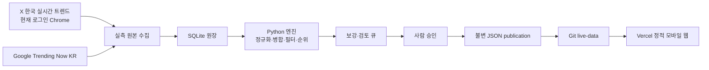
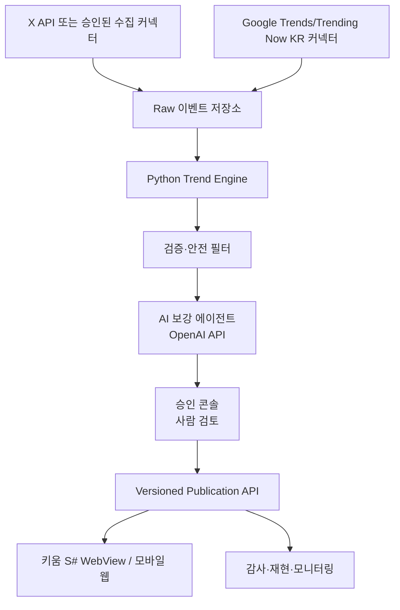

# TRZIP 제품·기술·발표 기준안

기준일: 2026-08-17
목적: 시연 화면, 실제 운영 파이프라인, 향후 API 기반 구조를 구분하고 팀의 개발·발표 판단 기준을 하나로 고정한다.

## 1. 제품 정의

> **TRZIP은 온라인 관심 신호를 사람이 검토 가능한 트렌드 사건으로 정리하고, 근거 있는 기업 탐색과 기존 종목 화면 진입을 연결하는 트렌드 인텔리전스 서비스다.**

TRZIP은 매수 종목을 추천하거나 미래 주가를 예측하지 않는다. 사용자가 분산된 관심 신호와 기업 자료를 오가며 해야 했던 탐색을 줄이고, `왜 지금 뜨는지`와 `어떤 사업 관계가 있는지`를 확인하게 한다.

### 사용자 핵심 흐름

```text
트렌드 확인
  → 무엇이며 왜 관심을 받는지 확인
  → 관심 흐름·단계·연관 키워드 탐색
  → 관계 근거가 있는 기업 탐색
  → 기업 정보와 기존 키움 종목 화면으로 이동
```

밈트폴리오는 재방문과 공유를 돕는 부가기능이다. TRZIP의 핵심 가치는 언제나 `트렌드 → 기업 탐색`이다.

## 2. 지금 실제로 구현된 구조



| 계층 | 현재 구현 | 책임 |
|---|---|---|
| 수집 | 로그인 Chrome의 X, Google Trending Now KR 웹 수집 | 실제 관측 원본 저장 |
| 원장 | Python, SQLite | 시간별 원본·감사 이력 보존 |
| 순위 | Python 결정론적 로직 | 정규화, 사건 병합, 안전 필터, 순위 계산 |
| 보강 | 공식 페이지·공시·뉴스·선택적 LLM 검토 | 맥락과 기업 관계 근거 수집, 순위에는 영향 없음 |
| 발행 | manifest-first JSON publication | 검증한 한 시점의 데이터 묶음만 공개 |
| 화면 | HTML/JavaScript, Vercel | 모바일 탐색·기업 시트·밈트폴리오 시연 |

### 현재의 정직한 경계

- UI의 쇼케이스 데이터와 실제 SQLite 수집 데이터는 아직 하나의 발행 체인으로 완전히 정합화되지 않았다.
- 따라서 발표와 데모에서는 검증된 화면 기능과 실제 수집 파이프라인을 구분한다.
- 실제 수집이 불완전하면 빈 상태·부분 수집 상태를 유지한다. 이전 값, 목업, 생성값으로 메우지 않는다.

## 3. AI 에이전트의 올바른 위치

TRZIP을 `AI 에이전트 서비스`로 규정하지 않는다. AI는 내부의 **검토 보조 에이전트**다.

| AI가 해도 되는 일 | AI가 하면 안 되는 일 |
|---|---|
| 모호한 표현의 맥락 후보 제시 | 트렌드 순위·점수 변경 |
| 다른 표기의 사건 병합 검토 | 실제 관측이 없는 트렌드 생성 |
| `왜 지금` 설명 초안 작성 | 근거 없는 기업 연결 생성 |
| 공식 URL·공시·IR 근거를 바탕으로 관계 요약 | 매수·매도·목표가 제시 |
| 보강 큐와 검토 우선순위 제안 | 사람 승인 우회 공개 |

이를 발표에서는 **Human-in-the-loop Trend Intelligence Engine**으로 설명한다.

## 4. 목표 운영 아키텍처

현재의 Windows 수집 노드는 MVP 운영에 적합하다. 서비스 확장 시에는 수집과 공개를 분리한 API 구조로 전환한다.



### 목표 기술 선택

| 영역 | MVP 현재 | 확장 목표 | 전환 이유 |
|---|---|---|---|
| 수집 실행 | Codex Desktop + Windows | 관리형 작업 실행기 | 노트북 상태 의존성 축소 |
| 트렌드 원천 | Chrome X 수집 + Google 웹 | X API + 정식 커넥터 | 인증·재시도·감사 안정성 |
| 저장소 | SQLite | PostgreSQL + 원본 객체 저장소 | 동시성·이력 조회·운영 분석 |
| 분석 API | 로컬 Python 모듈 | FastAPI worker/API | 승인 콘솔·앱 분리 |
| AI 보강 | 선택적 검토 | OpenAI Responses API + 도구 호출 | 근거 URL 기반의 일관된 검토 큐 |
| 시장 정보 | pykrx, OpenDART, Yahoo 검증 | 키움/정식 시장데이터 계약 | 현재성·라이선스·앱 일관성 |
| 클라이언트 | 정적 HTML/JavaScript | 키움 웹뷰 우선, 필요 시 React/Next | 상태 관리와 앱 내 진입 통합 |

## 5. 데이터 계약과 안전 장치

1. X 한국 1~30위와 Google Trending Now KR만 후보·순위 입력으로 쓴다.
2. Python만 점수와 순위를 확정한다.
3. 뉴스·공식 페이지·AI는 설명과 기업 관계 근거에만 사용한다.
4. 정치, 범죄, 재난, 사생활, 혐오, 직접 피해 중심 이슈는 공개 후보에서 제외한다.
5. 관련 기업은 기업 수를 채우지 않는다. 각 기업에는 현재 상장 여부, 역할, 근거 URL, 연결 이유가 있어야 한다.
6. 최종 발행은 자동 결과가 아니라 찬희님의 승인 영수증이 있는 트렌드만 허용한다.
7. 수집 실패·결측은 숨기거나 보간하지 않고 감사 이력으로 남긴다.

## 6. 발표 구성: 7장 이야기

| 장 | 메시지 | 보여줄 것 |
|---:|---|---|
| 1 | 문제: 관심 신호와 기업 탐색은 분절돼 있다 | SNS·검색·뉴스·종목 화면을 오가는 기존 흐름 |
| 2 | 사용자: 트렌드를 투자 판단 전의 조사 출발점으로 쓰고 싶다 | 짧은 사용자 시나리오와 설문 근거 |
| 3 | 해결: TRZIP은 트렌드를 사건으로 정리한다 | Dial/List의 트렌드 탐색 화면 |
| 4 | 신뢰: AI가 순위를 정하지 않는다 | X·Google → Python → 검토·승인 흐름 |
| 5 | 차별점: 기업을 단순 나열하지 않고 역할·근거로 연결한다 | 관련 기업 3~4개 역할군, 기업 바텀시트 |
| 6 | 전환: 탐색을 기존 키움 종목 분석으로 연결한다 | 기업 시트 → 종목 화면 CTA |
| 7 | 확장: 데이터 API·승인 운영·검증 지표로 고도화한다 | 목표 아키텍처와 파일럿 KPI |

### 90초 시연 대본

1. 홈에서 하나의 트렌드를 고른다.
2. `무엇인가요`와 `왜 관심을 받나요`를 보여 주며, 단순 검색어가 아닌 사건 단위라는 점을 설명한다.
3. 관심 흐름과 단계는 관심의 상대적 변화이지 투자 점수가 아님을 짧게 말한다.
4. 관련 기업 버튼을 바로 눌러 역할별 관계와 근거를 본다.
5. 기업 하나를 열어 가격·시가총액·PER/PBR/ROE와 연결 이유를 보고 기존 종목 화면으로 이어진다.
6. 마지막에 “순위는 실측 원천과 Python, 설명·보강은 AI와 사람 검토”라는 운영 원칙을 말한다.

## 7. 개발 우선순위

### P0 — 발표 전 반드시 끝낼 것

- 실제 수집, SQLite, publication, 프런트가 동일 publication ID를 바라보도록 정합화한다.
- 후보별 사람 승인 큐와 승인 영수증을 실제 발행 게이트로 유지한다.
- 모든 공개 기업에 연결 이유·역할·현재 상장 검증·시장 데이터 기준일을 채운다.
- 화면의 클릭, 뒤로가기, 차트 전환, 로고, 바텀시트와 로딩 상태를 모바일 E2E로 통과시킨다.
- 시연 데이터가 쓰인다면 발표에서 사실과 다르게 `실시간`으로 주장하지 않는다.

### P1 — 다음 개발 단위

- 실제 X API 도입 가능성·비용·약관을 검토하고, 승인된 수집 커넥터로 교체한다.
- FastAPI 기반 승인 콘솔과 versioned publication API를 만든다.
- OpenAI 보강 에이전트에 URL 인용 강제·스키마 검증·재시도·사람 검토 큐를 붙인다.
- 과거 트렌드의 당시 관계·사후 가격 흐름을 별도 `회고` 기능으로 제공한다. 결과를 원인으로 단정하지 않는다.

### P2 — 파일럿 이후 판단할 것

- 실제 사용자 행동 데이터로 재방문, 기업상세 진입, 종목 화면 전환을 측정한다.
- 키움 내부 데이터·주문 화면·로그인 권한과의 통합은 보안·준법 검토 후 진행한다.
- 밈트폴리오 공개 범위와 신고·모더레이션 정책을 설계한다.

## 8. 성공 지표

초기에는 MAU만으로 성패를 말하지 않는다.

- 트렌드 상세 진입률
- 관련 기업 보기 클릭률
- 기업 바텀시트에서 종목 화면으로의 전환율
- 연결 근거 열람률
- 승인 전 후보의 안전 필터 정확도와 사람 수정률
- 7일 재방문율

## 9. 발표에서 피할 표현

- `AI가 수혜주를 추천합니다`
- `실시간이므로 항상 정확합니다`
- `트렌드가 주가를 올립니다`
- `관련 기업이므로 투자해야 합니다`

대신 다음 표현을 쓴다.

> TRZIP은 실측 관심 신호를 바탕으로 사람이 검토한 기업 탐색 출발점을 제공합니다. 기업 연결은 투자 권유가 아닌 관계 정보이며, 최종 투자 판단은 사용자에게 있습니다.
